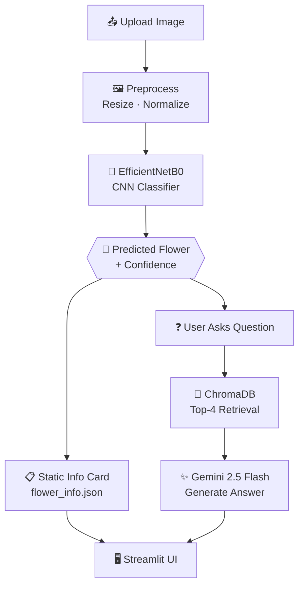

# 🌸 AI-Powered Flower Classifier with RAG-Based Q&A

A deep learning system that classifies **10 flower species** from a custom dataset captured using mobile phones in real outdoor environments.

The system combines deep learning, explainable AI (Grad-CAM), and a Retrieval-Augmented Generation (RAG) pipeline to provide accurate flower identification together with detailed information about each predicted flower.

---

## 🔗 Live Demo

<p align="center">
  <a href="https://flower-classification-bwuktirlzuulm62rfrw6wu.streamlit.app/" target="_blank">
    
  </a>
</p>
---

## 🏗️ Architecture at a Glance



*Two paths feed the same UI: the **prediction path** (image → CNN → flower + confidence + static info) and the **RAG path** (question → vector search → LLM → sourced answer). Full pipeline details are in the sections below.*

---

## 📌 What It Does

| Step | What Happens |
|------|-------------|
| 1 | User uploads a photo of a flower |
| 2 | EfficientNetB0 model classifies the species with a confidence score |
| 3 | Grad-CAM heatmap shows which part of the image the model focused on |
| 4 | Static info card displays scientific name, family, blooming season, uses |
| 5 | RAG chatbot answers free-text questions using a knowledge base of flower PDFs |

---

## 🌺 Flower Classes

`BOUGAINVILLEA` · `CHRYSANTHEMUM` · `COSMOS` · `GIANT CALOTROPE` · `GLEBIONIS CORONARIA` · `HIBISCUS` · `MARIGOLD` · `NAYANTARA` · `PETUNIA` · `TAGAR`

---

## 🧠 Model Building Pipeline

### 1. Data Collection
- Custom dataset containing **3,639 flower images**
- All images were captured using mobile phones in real outdoor environments
- Natural lighting and real backgrounds
- Close-up photography to emphasize flower features
- Images collected across ten flower species with varying sample sizes

### 2. Real-World Test Set Reservation
Before any processing, **10 images per class (100 total)** were permanently moved to a separate folder. These images were never seen during training, validation, or testing and were reserved solely for final independent evaluation using Grad-CAM.

### 3. Quality Scoring and Cleaning
A quality pipeline was applied to majority classes (**PETUNIA, NAYANTARA, BOUGAINVILLEA, TAGAR**):

| Metric | Method |
|--------|--------|
| **Blur Score** | Laplacian variance on centre 50% of image only — excludes blurred phone background |
| **Brightness Score** | Mean pixel intensity on the full image |
| **Contrast Score** | Standard deviation of pixel intensities |
| **Duplicate Flag** | Perceptual hashing with distance threshold of 8 |

A **deletion budget** was calculated per class — how many images could be removed while maintaining minimum training counts. PETUNIA could delete 236; TAGAR could delete zero. A **composite score (70% blur + 30% brightness deviation)** ranked images for removal. Flagged images were moved to a quarantine folder rather than permanently deleted, keeping them fully recoverable.

### 4. Class Balancing
After quality cleaning, majority classes were reduced to a consistent number of high-quality images, while minority classes retained all original samples because every image was considered valuable for training. This approach improved dataset quality without sacrificing limited data from underrepresented classes.

### 5. Train / Val / Test Split
Fixed counts per class regardless of class size:
- **Validation:** 20 images per class
- **Test:** 30 images per class
- **Training:** all remaining images

### 6. Augmentation — Training Folder Only

To address class imbalance, data augmentation was applied only to the training images of minority classes. A randomized augmentation strategy was used, combining transformations such as horizontal flipping, rotation, brightness adjustment, contrast adjustment, and zoom-based cropping. Flower color was intentionally preserved to maintain important visual characteristics, resulting in more diverse and realistic training samples while reducing overfitting.
> **Color shifts were never applied** — flower color is a primary identification feature and artificially shifting it would mislead the model.

A safety rule ensured at least one transformation was always applied per augmented image.

### 7. Model Architecture
**EfficientNetB0** pretrained on ImageNet — chosen for its accuracy-to-parameter ratio and compatibility with the Colab T4 free GPU.

```
EfficientNetB0 (pretrained backbone)
    ↓
GlobalAveragePooling2D
    ↓
BatchNormalization
    ↓
Dense(256, activation='relu')
    ↓
Dropout(0.3)
    ↓
Dense(10, activation='softmax', dtype=float32)
```

Mixed precision training (`float16`) was enabled to halve VRAM usage and improve speed, with the final softmax layer kept in `float32` for numerical stability.

### 8. Three-Phase Training

| Phase | Frozen Layers | Learning Rate | Epochs | Purpose |
|-------|--------------|--------------|--------|---------|
| **Phase 1** | Entire EfficientNetB0 | `0.001` | 10 | Train classification head only |
| **Phase 2** | Bottom 70% of EfficientNetB0 | `0.0001` | 10 | Fine-tune top 30% of backbone |
| **Phase 3** | None (full network) | `0.00001` | 10 | Microscopic final adjustments |

Early stopping monitored validation loss throughout all phases. Best checkpoint saved to Google Drive after every epoch improvement.

---

### Data Leakage Analysis

The initial model exhibited severe overfitting with unrealistically high validation and test accuracy. Investigation using perceptual hashing identified **11.2% data leakage** caused by near-duplicate images being distributed across different dataset splits. This issue was resolved by implementing a leak-safe splitting strategy.

### 9. Leak-Safe Splitting (Fix)
The splits folder was deleted entirely. A new splitting algorithm was built:

1. Perceptual hashes pre-computed for every image before any assignment
2. For each validation and test candidate, its hash was compared against every image that would become training
3. If the closest hash distance was ≤ 10, the candidate was **rejected** and a different image was selected
4. Repeated until zero leakage guaranteed across all splits

### 10. Clean Results
The tell-tale sign of a clean model was visible immediately — Phase 1, epoch 1 showed **99% validation accuracy** (not 100%). Two images were genuinely misclassified, exactly as expected from a model that hadn't yet seen the validation images. It improved to 100% by epoch 2 through actual learning.

| Metric | Result |
|--------|--------|
| Test Accuracy | **100%** |
| Weighted F1 Score | **1.0** |
| Confusion Matrix | Perfect diagonal across all 10 classes |
| Data Leakage | **0%** (verified) |

### 11. Grad-CAM Validation
Grad-CAM was applied to the **92 reserved real-world images** (images never used in any training or testing phase). A key implementation decision: **pre-softmax logits** were used instead of softmax probabilities.


**Result:** Heatmaps consistently highlighted petals, flower centres, and distinctive structural features — not backgrounds. This confirmed the model learned genuine discriminative floral features, not dataset artifacts.

---

## 🤖 RAG System Pipeline

The RAG (Retrieval-Augmented Generation) system answers free-text questions about any predicted flower using a knowledge base of PDF documents.

```
User Question
     ↓
Query Augmentation
("Petunia: which season does it bloom?")
     ↓
ChromaDB Vector Search
(top-4 most similar chunks)
     ↓
Retrieved Context
     ↓
Gemini LLM (gemini-2.5-flash)
     ↓
Answer + Source Citations
```

### Knowledge Base
11 PDF documents stored in `data/knowledge_base/`:
- **10 individual flower PDFs** — one per class, each covering distribution in India, blooming season, cultural significance, cultivation, uses, and key facts
- **1 combined Flowers Encyclopedia** — master reference covering all 10 flowers

**Total:** ~161 chunks after splitting at 700 characters with 100-character overlap.

### Embedding and Storage
- **Embedding model:** `gemini-embedding-001`
- **Vector store:** ChromaDB (local persistent store committed to GitHub)
- **Ingestion:** `ingest.py` runs once offline. Batched at 80 chunks per request with 65-second waits between batches to respect the Gemini free-tier 100 requests/minute limit.
- **Query augmentation:** Flower name is prepended to every query (`"Petunia: which season does it bloom?"`) to improve retrieval precision

### Why Pre-built Vector DB
The `vector_db/` folder is committed to GitHub so Streamlit Cloud has the database immediately on startup. The app never re-embeds documents — keeping it fast and protecting API quota.

---

## 🗂️ Project Structure

```
flower-ai/
│
├── app.py                         ← Streamlit UI — coordinates all layers
├── ingest.py                      ← One-time script: builds vector_db/ from PDFs
├── requirements.txt
├── packages.txt                   ← System deps for Streamlit Cloud (libgomp1, libglib2.0-0)
│
├── .streamlit/
│   └── config.toml                ← Theme (plum/cream palette)
│
├── model/
│   └── final_model.keras          ← Trained EfficientNetB0 model
│
├── src/
│   ├── predictor.py               ← ML inference layer (no Streamlit imports)
│   ├── rag_pipeline.py            ← Chroma + Gemini layer (no Streamlit imports)
│   ├── gradcam.py                 ← Grad-CAM computation and overlay
│   └── utils.py                   ← Shared helpers
│
├── data/
│   ├── class_names.json           ← 10 class names in training order
│   ├── flower_info.json           ← Static info for each flower
│   └── knowledge_base/            ← 11 PDFs for RAG ingestion
│
└── vector_db/                     ← Pre-built ChromaDB (committed to GitHub)
    ├── chroma.sqlite3
    └── [collection data files]
```

### Architecture — Three Clean Layers

The codebase is intentionally split into three independent layers:

| Layer | File | Job |
|-------|------|-----|
| **ML Layer** | `src/predictor.py` | Preprocess image → run model → return prediction |
| **RAG Layer** | `src/rag_pipeline.py` | Retrieve chunks → call Gemini → return answer |
| **UI Layer** | `app.py` | Render everything, call the layers above |

Each layer has zero knowledge of the others' internals. `app.py` can be replaced with a different frontend without touching the ML or RAG logic.

---

## ⚙️ Setup and Installation

### 1. Clone the repository
```bash
git clone https://github.com/your-username/flower-ai.git
cd flower-ai
```

### 2. Create and activate a virtual environment
```bash
python -m venv venv
# Windows
venv\Scripts\activate
# macOS / Linux
source venv/bin/activate
```

### 3. Install dependencies
```bash
pip install -r requirements.txt
```

### 4. Add your Gemini API key
Create a `.env` file in the project root:
```
GOOGLE_API_KEY=your_gemini_api_key_here
```
Get a free key at [Google AI Studio](https://aistudio.google.com/app/apikey).

### 5. The vector database is already built
The `vector_db/` folder is committed to the repo — no need to run `ingest.py` unless you add new PDFs.

### 6. Run the app
```bash
streamlit run app.py
```

---

## ☁️ Streamlit Cloud Deployment

1. Push the repo to GitHub (including `vector_db/`)
2. Go to [share.streamlit.io](https://share.streamlit.io) and connect the repo
3. Set `app.py` as the main file
4. Under **Settings → Secrets**, add:
   ```
   GOOGLE_API_KEY = "your_real_key_here"
   ```
5. Deploy — the app starts immediately using the pre-built vector database

---

## 🧪 Rebuilding the RAG Knowledge Base

Only needed if you add or change PDFs:

```bash
python ingest.py
```

The script splits PDFs into chunks and embeds them in batches of 80 with 65-second pauses to respect the Gemini free-tier 100 requests/minute limit (~2.5 minutes total for 161 chunks). Commit the rebuilt `vector_db/` to GitHub afterwards.

---

## ⚠️ Known Limitations

**COSMOS and CHRYSANTHEMUM confusion** — Both classes had fewer than 90 original training images before augmentation. Their visual similarity combined with limited training data makes the model occasionally swap these two.

---

## 🛠️ Tech Stack

| Component | Technology |
|-----------|-----------|
| **Frontend** | Streamlit |
| **Deep Learning** | TensorFlow / Keras |
| **Backbone** | EfficientNetB0 (ImageNet pretrained) |
| **Explainability** | Grad-CAM (pre-softmax logits) |
| **RAG Framework** | LangChain |
| **Vector Database** | ChromaDB |
| **Embedding Model** | Gemini Embedding 001 |
| **LLM** | Gemini 2.5 Flash |
| **Image Processing** | OpenCV, Pillow |
| **Deployment** | Streamlit Cloud |

---

## 👤 Author

**Lokenath Banerjee**
Final Year B.Tech — CSE (AI & ML)
Haldia Institute of Technology

[](https://www.linkedin.com/in/lokenath-banerjee-53a95928b/)
[](https://github.com/LokenathBanerjee)
